# Joiners

En esta lección aprenderemos a generar mapeo de datos con la transformación de **Joiner**

1. Creamos un nuevo mapa con el siguiente nombre **M_Practica_Jr** y definimos dos **Source**.

2. El primer **Source** será para tabla de **Rental** y configuramos de la siguiente manera:

    - Connection: **_conn_Postgres_dvdrental**
    - Source_Type: **Single Objet**

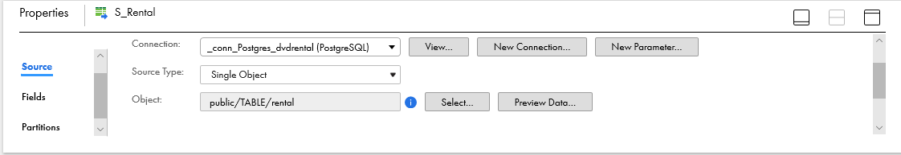

3. Damos clic en **Select** y seleccionamos **Public - > TABLE -> rental**, como se muestra en la imagen:

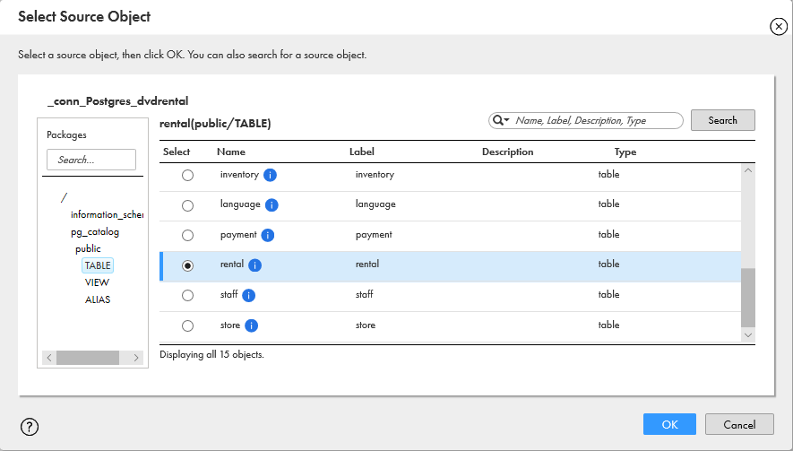

4. En las propiedades del **Source** seleccionar **Fields** para eliminar campos no requeridos y únicamente dejar los siguientes campos:

    - rental_id
    - inventory_id
    - customer_id

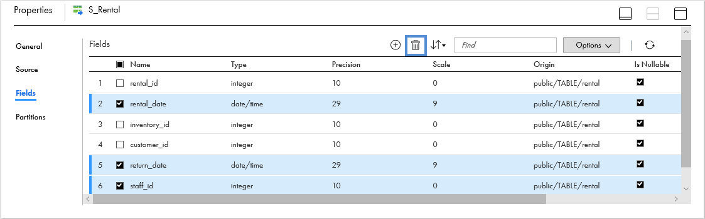

5. Agregamos un **Sorter** después de **Source**

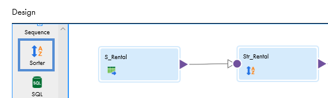

6. En las propiedades seleccionamos **Incoming Fields** y en las reglas damos clic en **rename** y configuramos como se muestra en la imagen:

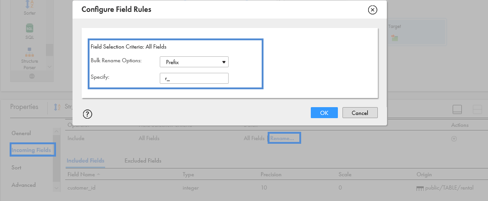

7. En las propiedades seleccionamos **Sort** y dar clic en **+** para configurarlo de la siguiente manera:

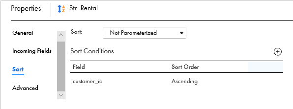

8. Repetimos los pasos que realizamos con **Rental** con la tabla **Customer** y dejamos los siguientes campos:

    - **Source**
        - customer_id
        - store_id
        - first_name
        - last_name
        - address_id

    - **Sorter**
        - **Rename** -> **c_**
        - **Curtomer_id** -> *Ascending*

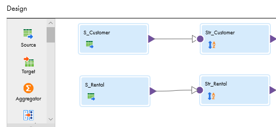

9. Agregamos la transformación **Joiner**, damos clic en **+** para poder enlazar el **Master** y **Detail**, quedando de la siguiente forma:

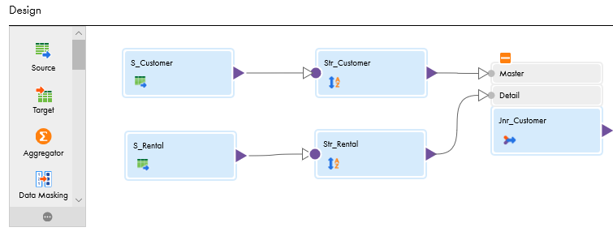

> **Master**: Tabla con registros únicos o que tiene el menor volumen de información.

> **Detail**: Tabla con el detalle de los registros.

10. En las propiedades del **Joiner** seleccionamos **Join Condition**, después **+** para agregar la condición para unir las dos tablas y configurar de la siguiente manera:

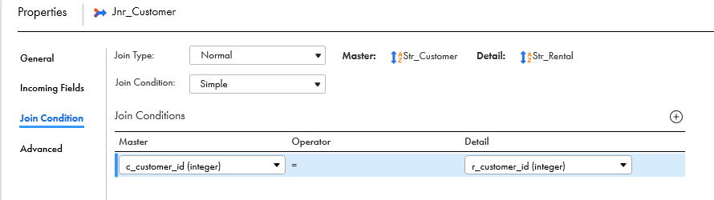

> Los campos de la condición deben tener el mismo tipo de dato.

11. Conectamos el **Joiner** al **Target**, en las propiedades de **Target** seleccionamos **Incoming Fields** y modificamos la regla de la siguiente manera:

    - Operador: **Include**
    - Field Selection Criteria: **Name_Fields**
    - Detail: **Configure...** -> Realizar la siguiente configuración:

__**Rule Details**__

- Seleccionar todos los campos menos **c_customer_id**

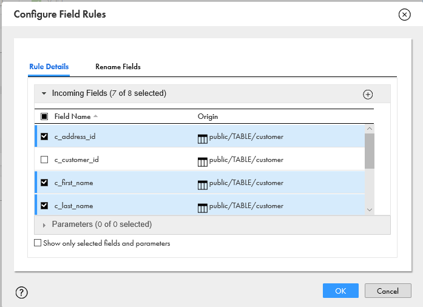

__**Rename Fields**__

- Renombramos los campos para quitarles el prefijo **c_** y **r_**.

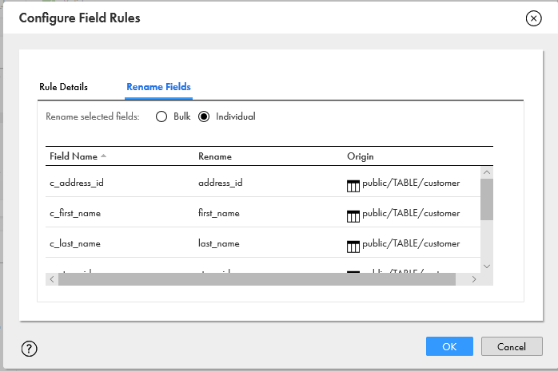

12. configuramos la salida a la base de datos de **Postgres** de la siguiente manera:
- Connection: **_conn_Postgres_course**
- Target_Type: **Single Objet**
- Object: **tbl_customer_** *iniciales* 
- Operation: **Insert**

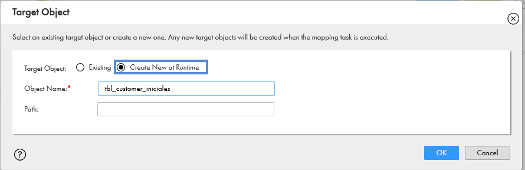

13. Desplegamos **Advanced** y seleccionamos la opción **Truncate target**.

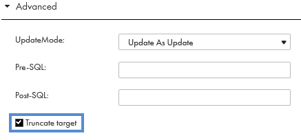

14. **Guardar** los cambios, revisar que el mapping sea **Válido** y **Ejecutar**.

15. En el monitor podemos visualizar la cantidad de registros que arroja el mapping después del **Joiner**

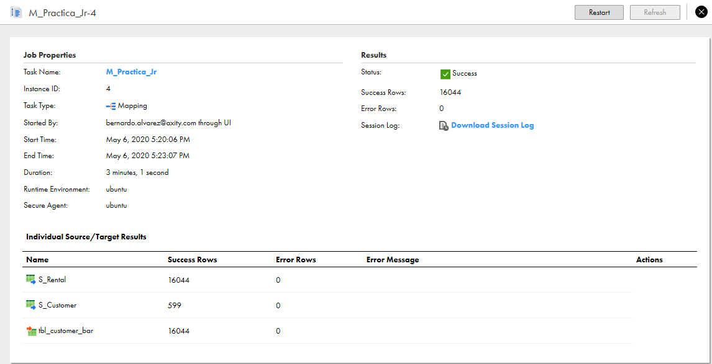
