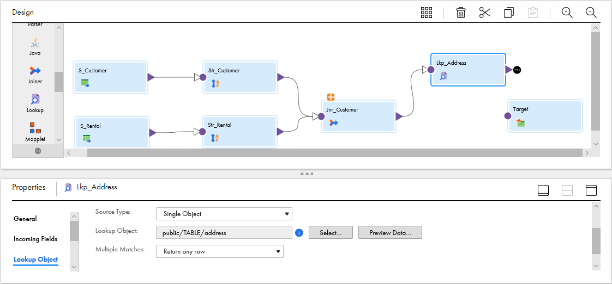
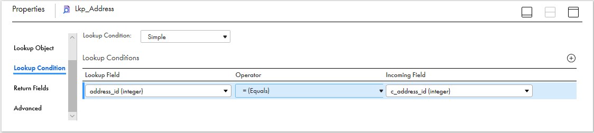
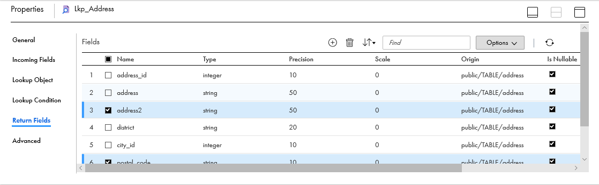
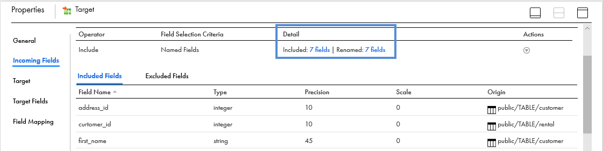
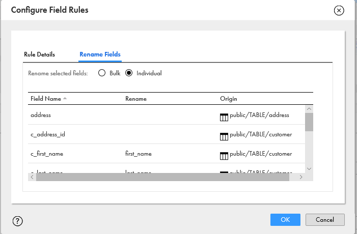

# Lookups

En esta lección aprenderemos a generar mapeo de datos con la tranformación de **Lookup**.

1. Duplicar el mapa **M_Practica_Jr** y renombrarlo como **M_Practica_Lkp**.

2. Agregar la transformación **Lookup** entre **Joiner** y **Target**. En las propiedades del **Lookup**, seleccionar **Lookup Object**, configuramos apuntando a la conexión **_conn_Postgres_dvdrental** y seleccionamos la tabla **public/TABLE/address**.

3. Seleccionar **Lookup Condition** en las propiedades, agregar una nueva condición y configurarlo de la siguiente forma:

> **Nota:** Los campos que se utilizan en la condición deben tener el mismo tipo de dato.

4. Seleccionar **Return Fields** y eliminar los siguientes campos.

	- address2
	- postal_code
	- phone
	- last_update

5. Enlazamos el **Lookup** al **Target**. Estando posicionado en **Target**->**Incoming Fields** configuramos los nombres de entrada.

> En este paso se debe deshabilitar el campo `address_id` que proviene de la tabla `address` para evitar problemas de ambigüedad en los nombres de los campos. Esto debe hacerse en  **Target**->**Incoming Fields**->**Field Rules**->**Include Operator**.

> Si se requiere eliminar el prefijo del campo `c_address_id`, se debe agregar un **Expression** después del **Lookup**.

6. Los campos que no tengan prefijo no se renombrarán y quedarán en blanco como se muestra en la imagen. 

7. Configuramos la salida a la base de datos y crearlo con el siguiente nombre **tbl_custaddr_[iniciales]**.

8. **Guardar** los cambios, revisar que el mapping sea **Válido** y **Ejecutar**.
