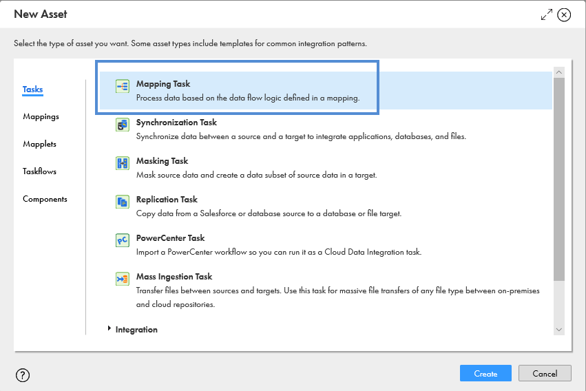
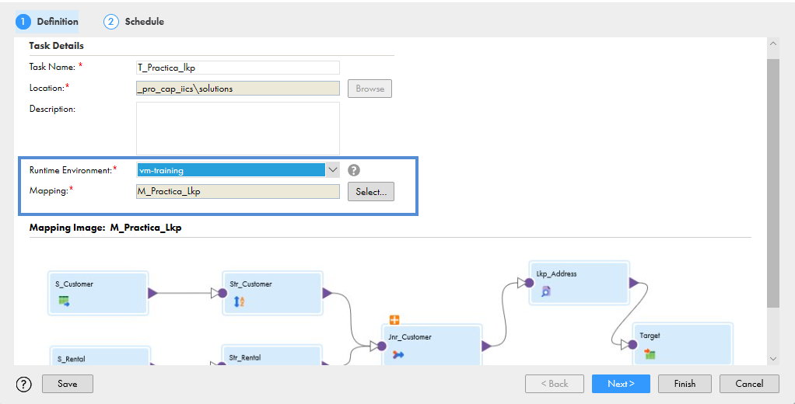
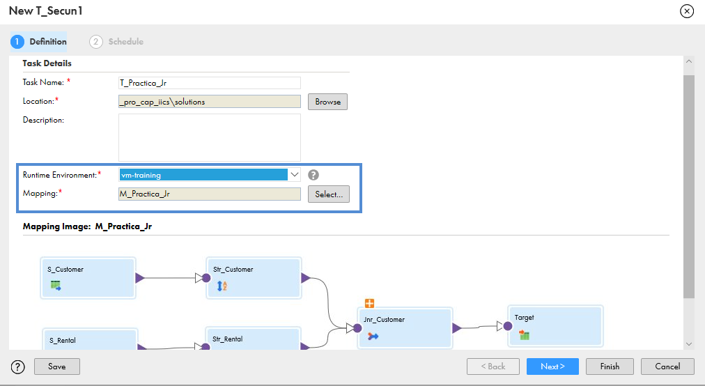
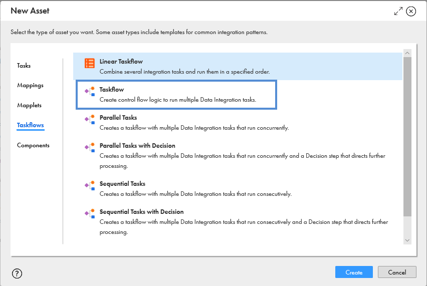
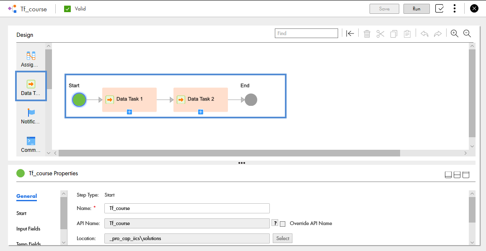
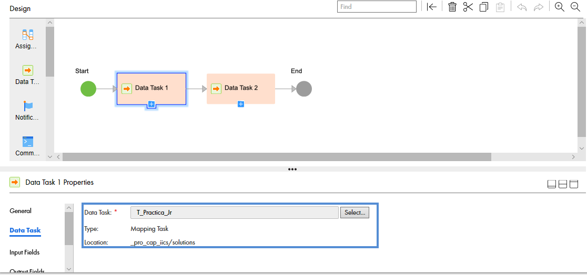

# Tasks y Taskflows

En esta lección aprenderemos a configurar **Task** y **Taskflow**

## Task

1. Seleccionar **New Asset** y elegimos la opción de **Mapping Task** como se muestra a continuación.

2. Seleccionamos el mapa de **M_Practica_Lkp** y el agente seguro.

3. En la configuración de **Schedule** agregaremos el correo electrónico en la opción de notificaciones.

4. Dar clic en **Finish**, validar los cambios y **Ejecutar**.

5. Realizar los mismos pasos, pero utilizando el mapa **M_Practica_Jr**.

## Task Flows

1. Seleccionar ***New Asset** y elegimos la opción de **Taskflows** como se muestra a continuación.

2. Agregamos un **Data Task** como se muestra a continuación y modificamos el nombre.

3. En las propiedades elegimos **Data Task** y seleccionamos la tarea **T_Practica_Jr** como se muestra a continuación.

4. Repetimos los pasos 2 y 3 pero utilizando la tarea **T_Practica_lkp**.

5. **Guardar** los cambios, revisar que el mapping sea **Válido** y **Ejecutar**.
