# Templates (aceleradores)

IICS proporciona templates tanto para **mappings** como para **tasks** que nos pueden facilitar nuestro desarrollo. Estos templates representan las tareas típicas o comunes dentro de un proyecto de integración o gestión de datos.

Existen diferentes templates, pero básicamente podemos identificarlos en los siguientes grupos:
    - Integración
    - Limpieza
    - Warehousing

En este ejercicio veremos cómo utilizar un template para implementar de forma rápida una tabla con funcionalidad de **Slowly Changing Dimension Type 2**.

```sql
CREATE TABLE dim_actor_usr01
(
    actor_sk integer NOT NULL,
    actor_id integer,
    actor_first_name character(50),
    actor_last_name character(50),
    valid_from date,
    valid_to date,
    current_flag character(1),
    crc_num integer,
    CONSTRAINT dim_actor_usr01_pkey PRIMARY KEY (actor_sk)
);
```

1. Ingresamos a [IICS](https://dm-us.informaticacloud.com) y seleccionamos **Data Integration**.

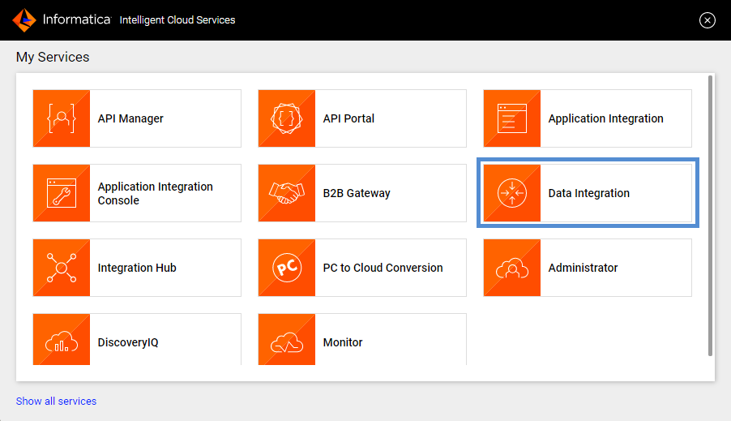

2. Del panel izquierdo seleccionamos **Explorar**, seleccionamos el proyecto **_pro_cap_iics** e ingresamos a nuestra carpeta. Estando es esta ruta, damos clic en el botón **Nuevo** que se encuentra en el panel izquierdo.

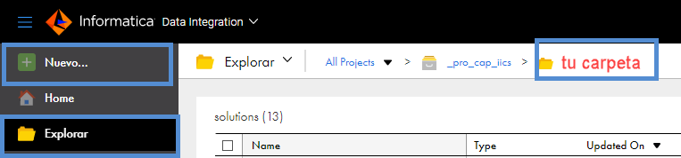

3. Seleccionar **Tasks**->**Warehousing**->**Slowly changing dimension Type 2**

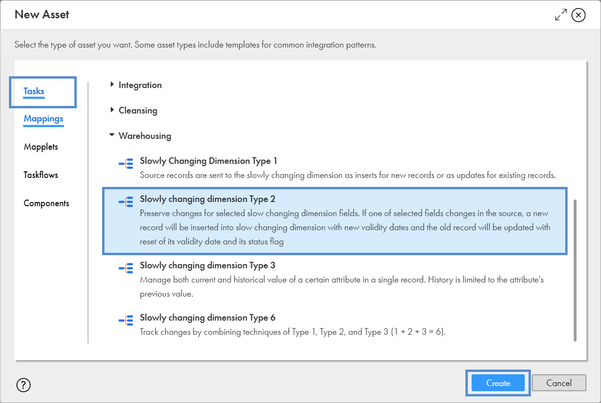

4. Ingresamos el nombre de la tarea como **T_Ejemplo_SCD_Tipo2** y el nombre del mapping como **M_Ejemplo_SCD_Tipo2**.

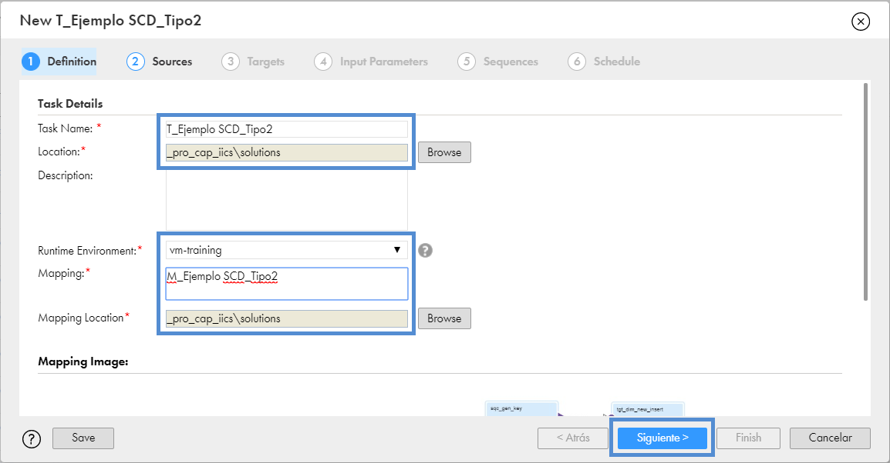

5. Configurar las conexiones fuente: 1. de la dimensión a cargar, 2. de los datos fuente.

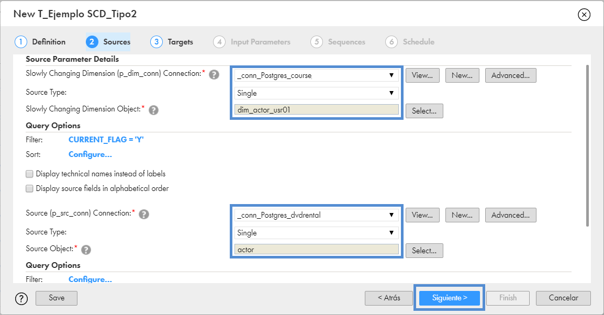

6. Configurar las conexiones destino para: 1. nuevos registros de versiones existentes, 2. actualización de registros actuales (desactivar registro), 3. nuevos registros.

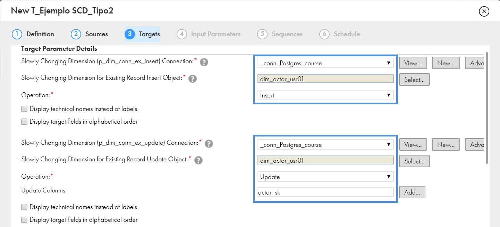
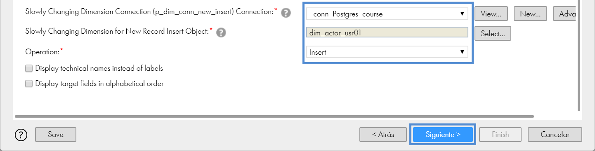

7. Configurar:
    - Llave natural de la dimensión
    - Llave subrogada de la dimensión
    - Llave primaria de la tabla fuente
    - Campos de la dimensión sobre los cuales se identificará una nueva versión del registro

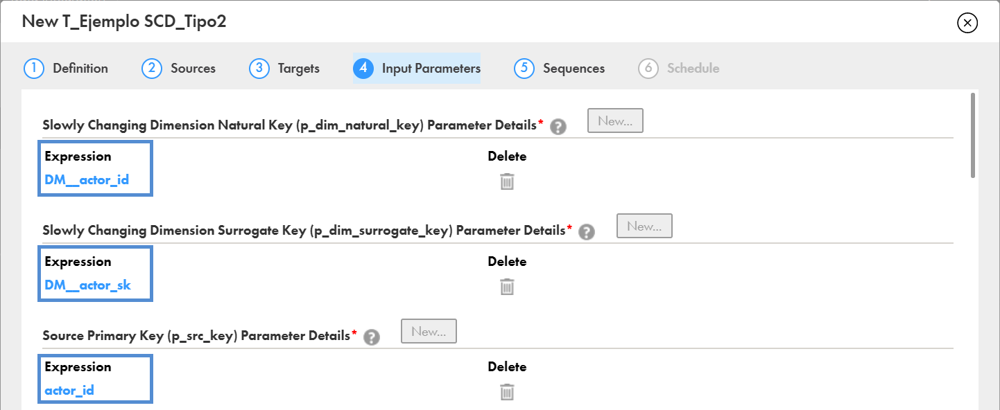
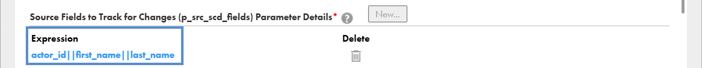

8. Configurar el mapeo de las conexiones destino como se muestra en la siguiente imagen:

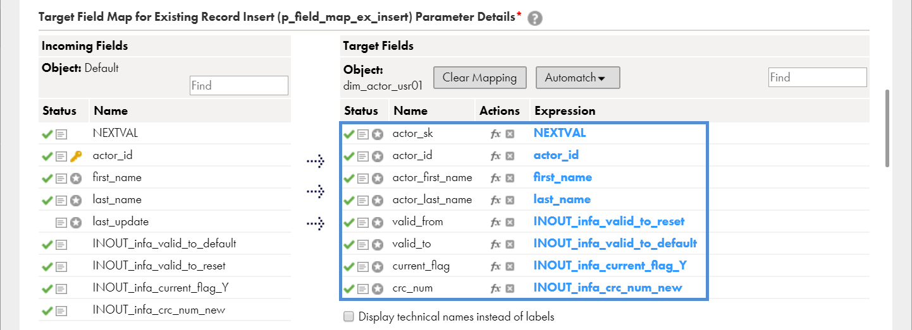
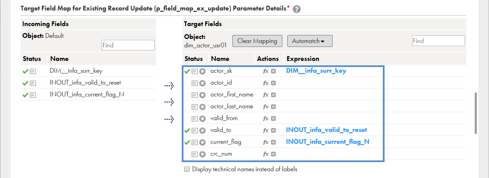
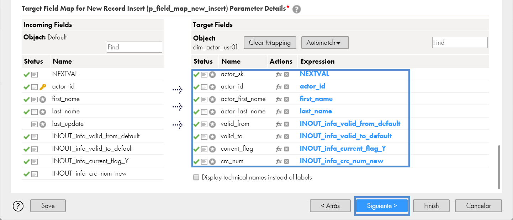

9. Este template utiliza una secuencia la cual es inicializada en 1. Dejar los valores por default.

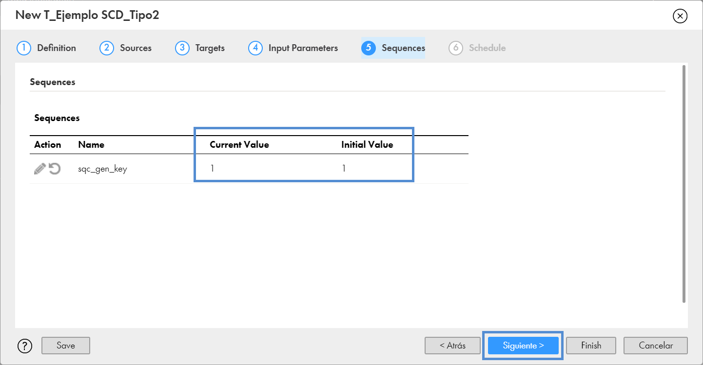

10. En esta pantalla podemos configurar la calendarización de esta tarea para que se ejecute de forma programada/automática. Para este ejercicio, dejar los valores por default.

11. Dar clic en el botón **Finish**.

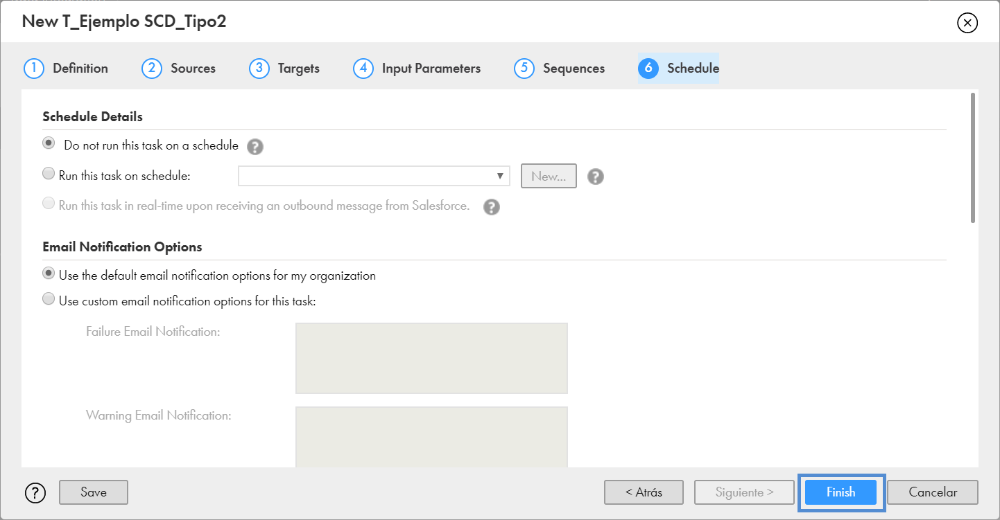

> Antes de ejecutar la tarea debemos crear la tabla `dim_actor_usr01` en la base de datos **course**. Utilice el siguiente script para crear la tabla:

12. Dar clic en el botón **Run**.

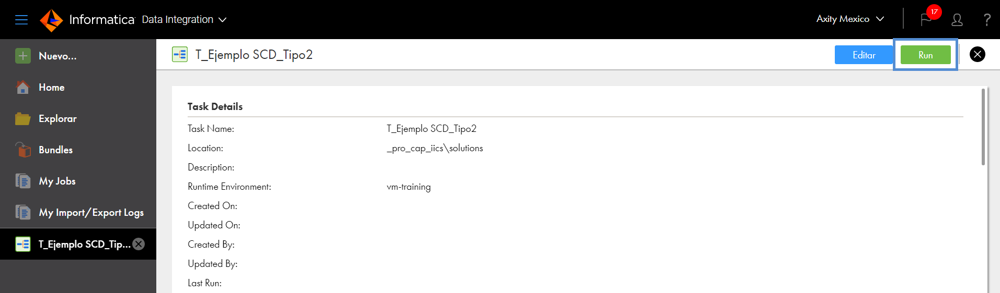

13. Ir a **My Jobs** para monitorear el proceso.

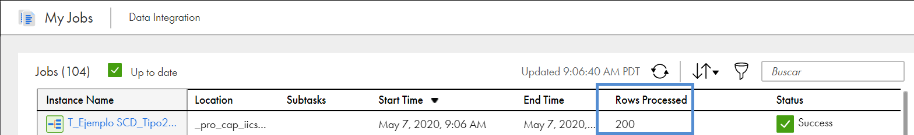

14. Una vez finalizada la ejecución consultamos los registros cargados en la dimensión.

```sql
select count(*) from dim_actor_usr01;
```

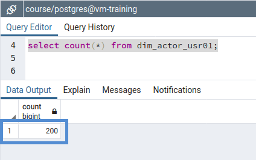

15. Para simular el efecto de SCD Type 2, modificaremos un registro del catálogo de actores.

```sql
update actor set last_name='course' where actor_id = 10;
```

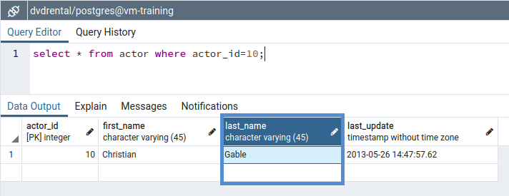

16. Validamos el cambio.

```sql
select * from actor where actor_id=10;
```

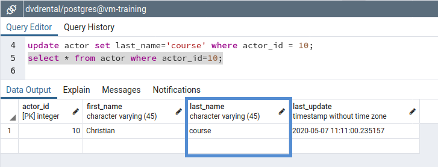

17. Ejecutamos nuevamente la tarea y monitoreamos el proceso. Al finalizar podemos observar que solo 2 registros fueron procesos: un **insert** para la nueva versión del registro y otro de **update** para la actualización del registro obsoleto.

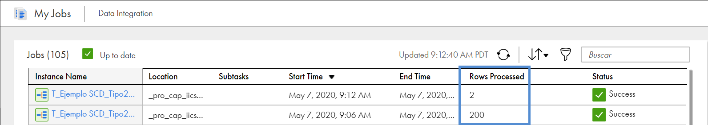

18. Verificamos el número de registros actuales en la dimensión.

```sql
select count(*) from dim_actor_usr01;
```

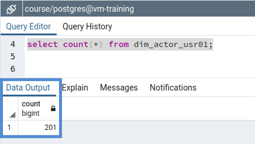

19. Consultar todas las versiones del actor.

```sql
select * from dim_actor_usr01 where actor_id=10;
```

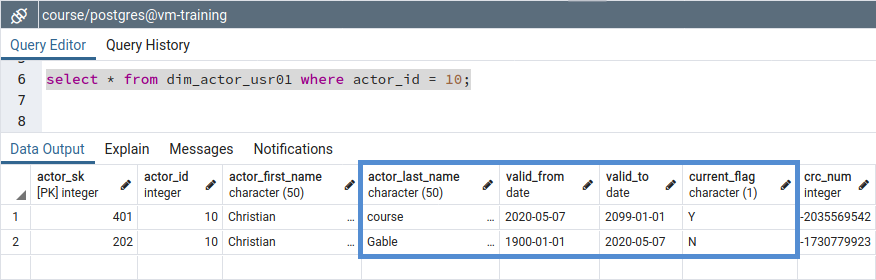
