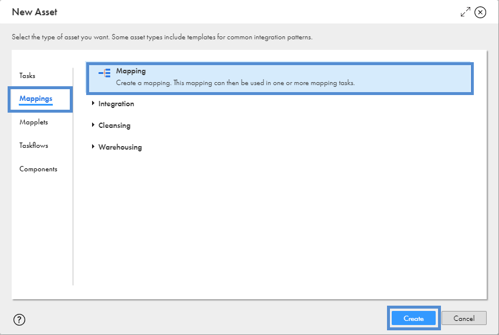
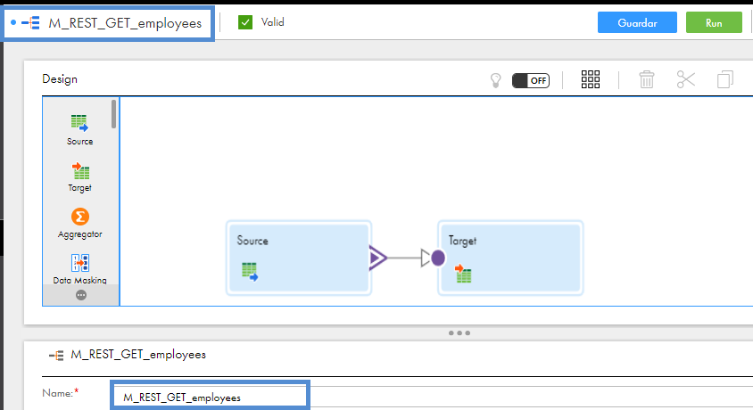
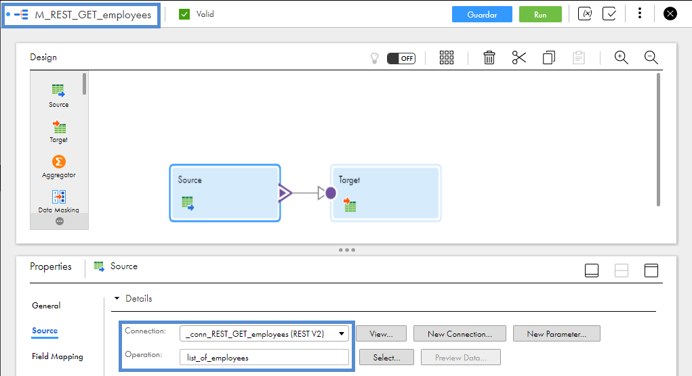
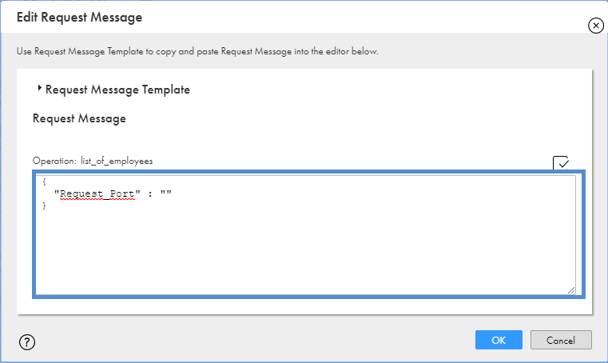
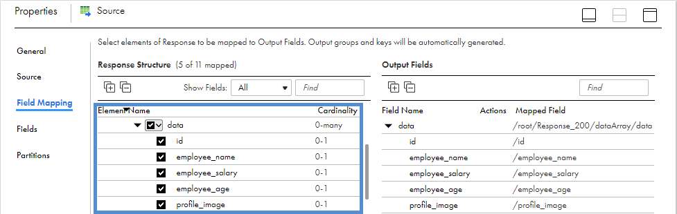
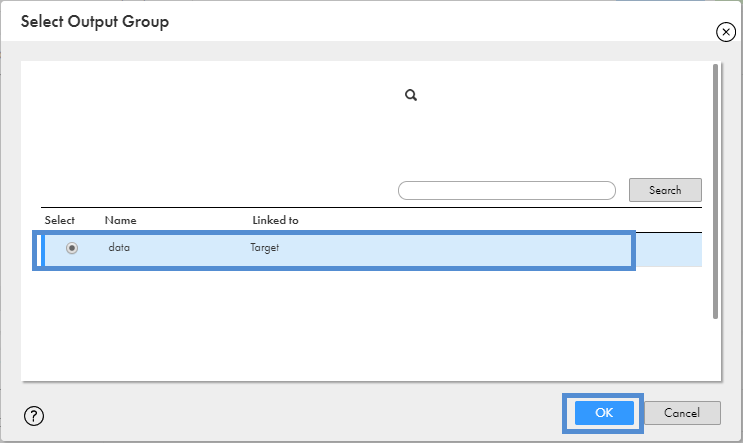
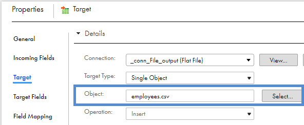
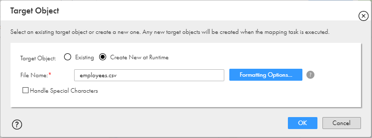
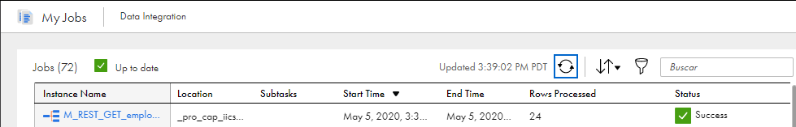
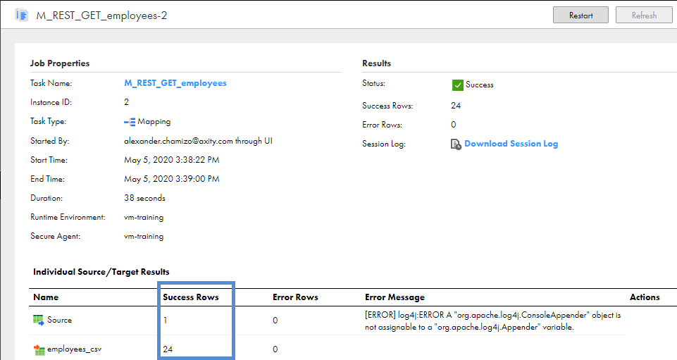

# Mapping usando API REST

**IICS** puede consumir servicios REST o SOAP de forma sencilla. En este ejemplo veremos cómo podemos consumir una API REST usando el sitio [Dummy REST API Example](http://dummy.restapiexample.com). En este sitio existen diferentes API's de prueba, pero para este ejemplo usaremos la API **employee** que devuelve un listado/catálogo de empleados.

> Revisar la conexión **_conn_REST_GET_employees** y el archivo Swagger **SW_REST_GET_employees**.

Para entender su funcionamiento ejecutaremos los siguientes pasos:

1. Ingresamos a [IICS](https://dm-us.informaticacloud.com) y seleccionamos **Data Integration**.

2. Del panel izquierdo seleccionamos **Explorar**, seleccionamos el proyecto **_pro_cap_iics** e ingresamos a nuestra carpeta. Estando es esta ruta, damos clic en el botón **Nuevo** que se encuentra en el panel izquierdo.

3. Seleccionar **Mappings**->**Mapping**

4. Establecer el nombre del mapping como **M_REST_GET_employees**.

5. Configurar **Source**->**Source** como se muestra en la siguiente imagen:

6. Configurar **Source**->**Source**->**Request Options** de la siguiente manera:

7. Configurar **Source**->**Field Mapping** como se muestra en la siguiente imagen:

> Seleccionar solo los campos del grupo **data**. Estos elementos se visualizan al expandir `/root/Response_200/dataArray/data`.

8. Enlazar **Source** a **Target**. Aparecerá un cuadro de dialogo solicitando el grupo de campos a incluir. Seleccionar **data**.

9. Configurar **Target**->**Target** como se muestra en la siguiente imagen:

> En la opción **Object** debemos dar clic en el botón **Select** para configurar el archivo de destino como se muestra en la siguiente imagen. En el nombre del archivo colocar como sufijo sus **iniciales** para identificarlo.

10. **Guardar**, **Validar** y Ejecutar (**Run**).

11. Seleccionar el agente seguro **vm-training** y dar clic en el botón **Run**.

12. Ir a **My Jobs** para monitorear la ejecución.

13. Revisar los registros leídos y cargados.

