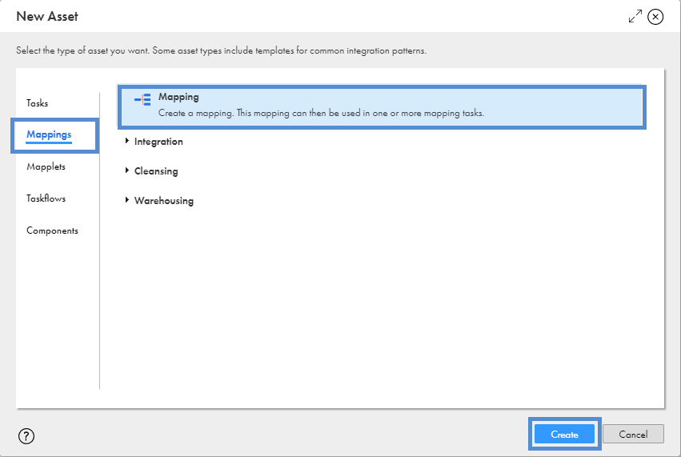

# Intelligent Structure Model

Intelligent Structure Model es un componente que de forma inteligente identifica el contenido de un archivo semiestructurado  o no estructurado y lo interpreta en una estructura relacional.

Para entender su funcionamiento ejecutaremos los siguientes pasos:

1. Ingresamos a [IICS](https://dm-us.informaticacloud.com) y seleccionamos **Data Integration**.

2. Del panel izquierdo seleccionamos **Explorar**, seleccionamos el proyecto **_pro_cap_iics** e ingresamos a nuestra carpeta. Estando es esta ruta, damos clic en el botón **Nuevo** que se encuentra en el panel izquierdo.

3. Seleccionar **Components**->**Intelligent Structure Model** y dar clic en el botón **Select**.

4. Seleccionar **Cloud Data Integration mappings** y dar clic en el botón **Select**.

5. Realizar la configuración como se muestra en la siguiente imagen:

6.  Después de seleccionar **Sample File**, dar clic en el botón **Discover Structure** para iniciar el proceso de discovery.

7. Seleccionar el nodo **number**, dar clic derecho y seleccionar **Exclude from Structure**

8. Guardar y cerrar.

9. Dar clic en el botón **Nuevo** que se encuentra en el panel izquierdo.

10. Seleccionar **Mappings**->**Mapping**

11. Configurar el mapping como se muestra en la siguiente imagen:

> En la paleta de transformaciones se debe seleccionar y arrastrar **Structure Parser** al área de diseño.

12. Configurar **Source**->**Source** como se muestra en la siguiente imagen:

> En **Formating Options**, seleccione la opción **Auto-generate** (esto indica al proceso leer desde el primer registro)

13. Configurar **Source**->**Fields** como se muestra en la siguiente imagen:

> Utilice el botón **Options->Edit Metadata & Use Labels** para cambiar el nombre del campo.

14. Configurar **Structure Parser**->**Structure Parser** como se muestra en la siguiente imagen:

> En este punto se debe utilizar el **Intelligent Structure Model** creado previamente.

15. Enlazar **Source** a **Structure Parser**.

16. Configurar **Structure Parser**->**Field Mapping** como se muestra en la siguiente imagen:

> Para realizar el mapeo, arrastre el campo **FIELD1** hacia **Data**.

17. Enlazar **Structure Parser** a **Target**. Aparecerá un cuadro de dialogo solicitando el grupo de campos a incluir. Seleccionar **element**

18. Configurar **Target**->**Target** como se muestra en la siguiente imagen:

> En la opción **Object** debemos dar clic en el botón **Select** para configurar el archivo de destino como se muestra en la siguiente imagen. En el nombre del archivo colocar como sufijo sus **iniciales** para identificarlo.

19. **Guardar**, **Validar** y Ejecutar (**Run**).

20. Seleccionar el agente seguro **vm-training** y dar clic en el botón **Run**.

21. Ir a **My Jobs** para monitorear la ejecución.

22. Revisar los registros leídos y cargados.

