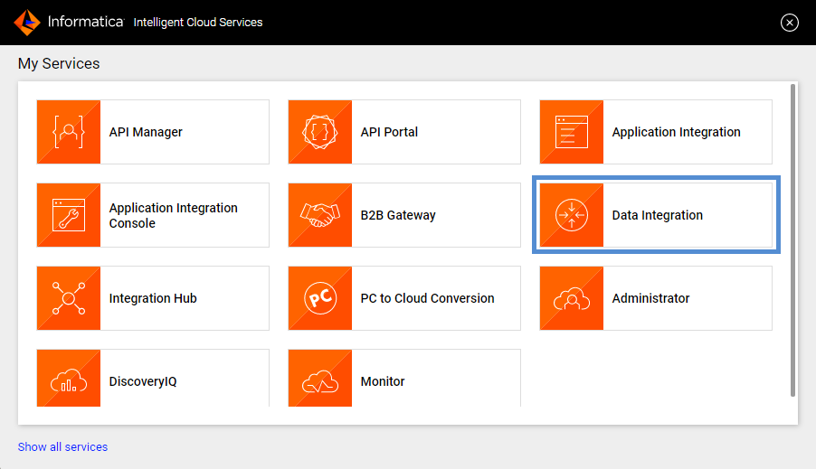

# Mapping usando AWS S3

**IICS** puede conectarse a servicios de **Amazon Web Services (AWS)** como **S3** o **Redshift**.

En este ejercicio crearemos un mapping para conectarnos a un **Bucket** de **AWS S3**

> Revisar la conexión **_conn_AWS_S3**.

Para entender su funcionamiento ejecutaremos los siguientes pasos:

1. Ingresamos a [IICS](https://dm-us.informaticacloud.com) y seleccionamos **Data Integration**.

2. Del panel izquierdo seleccionamos **Explorar**, seleccionamos el proyecto **_pro_cap_iics** e ingresamos a nuestra carpeta. Estando es esta ruta, damos clic en el botón **Nuevo** que se encuentra en el panel izquierdo.

3. Seleccionar **Mappings**->**Mapping**

4. Establecer el nombre del mapping como **M_AWS_S3_trace_events**.

5. Configurar **Source**->**Source** como se muestra en la siguiente imagen:

6. Enlazar **Source** a **Target**.

7. Configurar **Target**->**Target** como se muestra en la siguiente imagen:

> En la opción **Object** debemos dar clic en el botón **Select** para configurar el archivo de destino. En el nombre del archivo colocar como sufijo sus **iniciales** para identificarlo.

8. **Guardar**, **Validar** y Ejecutar (**Run**).

9. Seleccionar el agente seguro **vm-training** y dar clic en el botón **Run**.

10. Ir a **My Jobs** para monitorear la ejecución.

11. Revisar los registros leídos y cargados.

